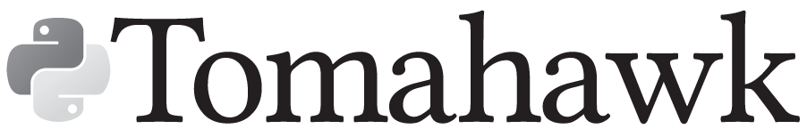

# pytomahawk

This package provides native Python3-bindings for interfacing with
[Tomahawk](https://github.com/mklarqvist/tomahawk/) libraries and provides
additional graphical functionality. This means exposing most of the features and
flexibility of the C++ API while not sacrificing the usability that Python provides.

### Contributing

Interested in contributing? Fork and submit a pull request and it will be
reviewed.

### Support
We are actively developing Tomahawk and are always interested in improving its
quality. If you run into an issue, please report the problem on our Issue
tracker. Be sure to add enough detail to your report that we can reproduce the
problem and address it. We have not reached version 1.0 and as such the function
names may change.

### Version
This is rtomahawk 0.1.0. rtomahawk follows [semantic
versioning](https://semver.org/).

### Author
Marcus D. R. Klarqvist (<mk819@cam.ac.uk>)  
Department of Genetics, University of Cambridge  
Wellcome Sanger Institute

### License
pytomahawk is licensed under [MIT](LICENSE)  
tomahawk is licensed under
[MIT](https://github.com/mklarqvist/tomahawk/blob/master/LICENSE)